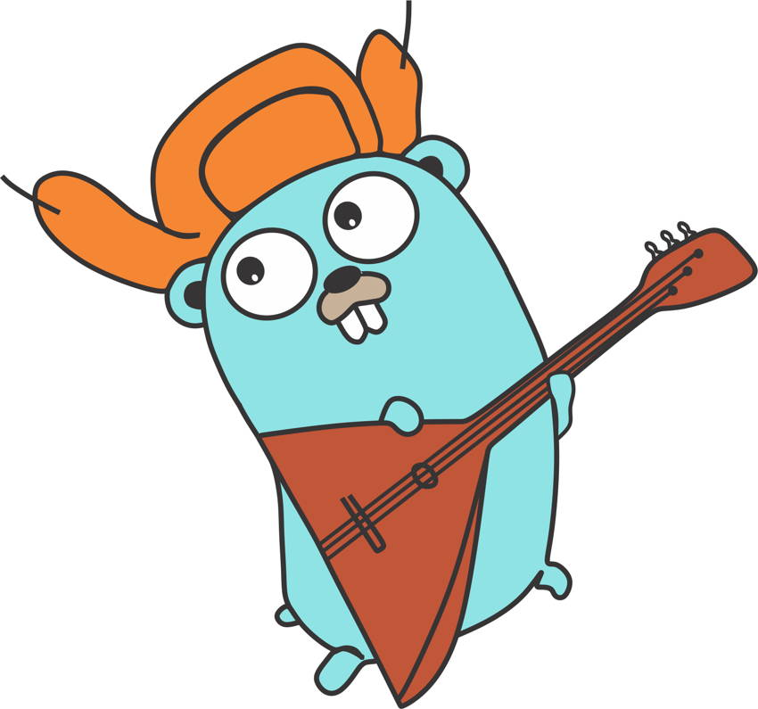

<h1 align="center">
	
	<br>
	<br>
</h1>

# Tips
- [Generate Persian Pdf](#GeneratePersianPdf)
- [See Docs](#SeeDocs)

### <a name="GeneratePersianPdf">Generate Persian Pdf</a>

```go
package main

import (
	"github.com/01walid/goarabic"
	"github.com/signintech/gopdf"
)

func reverseString(s string) string {
	runes := []rune(s)
	for i, j := 0, len(runes)-1; i < j; i, j = i+1, j-1 {
		runes[i], runes[j] = runes[j], runes[i]
	}
	return string(runes)
}

func main() {
	pdf := gopdf.GoPdf{}
	pdf.Start(gopdf.Config{PageSize: gopdf.Rect{W: 595.28, H: 841.89}}) //595.28, 841.89 = A4
	pdf.AddPage()
	pdf.AddTTFFont("HDZB_5", "./Vazir.ttf")

	pdf.SetFont("HDZB_5", "", 14)

	pdf.Cell(nil, reverseString(goarabic.ToGlyph("سلام دنیا.. این اولین متن پارسی نوشته شده با کمک کتابخانه signintech است.")))
	pdf.WritePdf("test1.pdf")

}
```

### <a name="SeeDocs">See Docs</a>

If you read more about builtin funcitons:

`godoc builtin cap`

Or, maybe you want to read more about fmt.Println():

`godoc fmt Printf`


