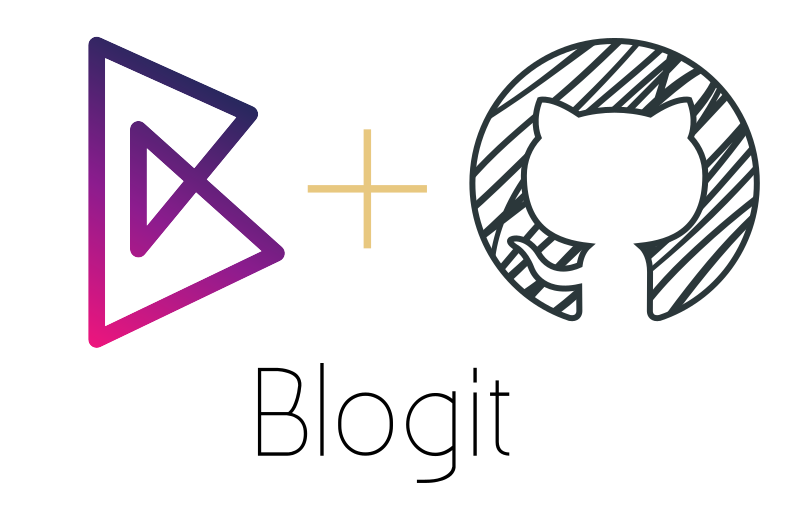

<h1 align="center">
	
	 
	 
    <p2>Manage And Store All Tips &amp; Tricks, config files and toturials.</p2>
</h1>

## Blog directory

- [OS](OS/)
	- [Arch](OS/Arch/)
        - [ChangeKernelToLTS](OS/Arch/ChangeKernelToLTS.md)
        - [Chroot](OS/Arch/Chroot.md)
        - [Cinnamon](OS/Arch/Cinnamon.md)
        - [ElideApps](OS/Arch/ElideApps.md)
        - [Installation](OS/Arch/Installation.md)
	- [NixOs](OS/NixOs)
        - [configuration](OS/NixOs/configuration.md)
        - [hardware-configuration](OS/NixOs/hardware-configuration.md)
	- [Windows](OS/Windows)
        - [Fix Bootloader](OS/Windows/bootloader.md)
- [Packages](Packages/)
	- [MPV](Packages/MPV/)
	    - [MPV-Tutorial](Packages/MPV/MPV-Tutorial.md)
	- [Tmux](Packages/Tmux)
        - [Tmux-Tutorial](Packages/Tmux/Tmux-Tutorial.md)
        - [tmux.conf](Packages/Tmux/.tmux.conf)
	- [ZSH](Packages/ZSH)
        - [ZSH-Tutorial](Packages/ZSH/ZSH-Tutorial.md)
        - [ZSH-Config](Packages/ZSH/Config)
            - [.zpreztorc](Packages/ZSH/Config/.zpreztorc)
            - [.zshrc](Packages/ZSH/Config/.zshrc)
    - [AndroidStudio](Packages/AndroidStudio.md)
    - [Clementine](Packages/Clementine.md)
    - [Git](Packages/Git.md)
    - [VirtualBox](Packages/VirtualBox.md)
    - [VSCode](Packages/VSCode.md)
